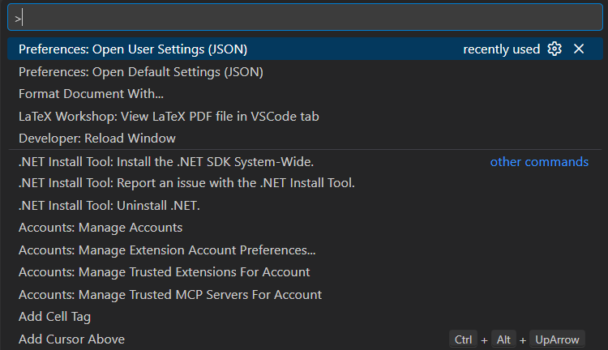
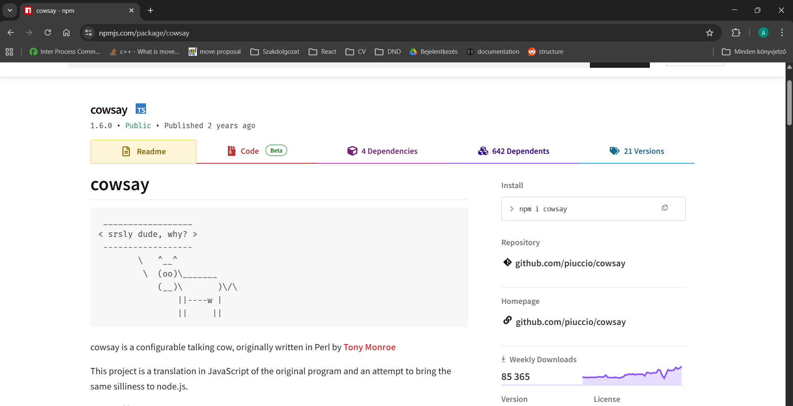
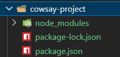

# Fejlesztőkörnyezet

Ajánlott a tárgyon a `VSCode` használata, én is ezt fogom használni, de természetesen bármilyen más fejlesztőkörnyezet is megfelel, amiben kényelmesen tudsz TypeScript-ben fejleszteni. Ha még nincs telepítve a gépedre, akkor a [VSCode letöltése](https://code.visualstudio.com/download) oldalon tudod letölteni.

## Bővítmények

Néhány `Extension` jó, ha telepítva van a tárgy hátralevő részében, ezek közül szerintem a legfontosabbak:

- `ESLint` - Ez segít abban, hogy a kódod megfeleljen a megadott stílusnak és szabályoknak, valamint segít elkerülni a gyakori hibákat. Röviden tehát egy `linter`, ami a kód minőségének javításában lesz a segítségünkre a félév során.
- `Prettier` - Ez egy kódformázó eszköz, amely automatikusan formázza a kódodat a megadott szabályok szerint. Ez segít abban, hogy a kódunk egységes legyen és könnyen olvasható maradjon. Javasolt használni a félév során, hogy ne vesszünk el a nagyobb komponensekben, könnyen átlássuk a kódunkat, akár ha tőlem kaptok kódrészleteket, akár ha a saját kódotokat nézitek. Igényel további beállításokat, mindjárt kitérünk rá.
- `ES7+ React/Redux/React-Native snippets` - Ez egy hasznos bővítmény, amely gyorsan létrehozhat React komponenseket és egyéb gyakori kódrészleteket. Ez megkönnyíti a fejlesztést és időt takarít meg, különösen akkor, ha sok ismétlődő kódot kell írni.

## VSCode konfiguráció

Érdemes néhány konfigurációs beállítást tenni a `VSCode`-ban, hogy fantasztikus fejlesztési élményben legyen részünk. Így például célszerű beállítani, hogy a `Prettier` automatikusan formázza a kódot mentéskor, illetve javasoljuk, hogy állítsátok is be default formatterként. Ehhez a következő lépéseket kell követni:

1. Nyisd meg a `VsCode`-ot
2. Használd a `Ctrl + Shift + P` billentyűkombinációt a parancspaletta megnyitásához, ekkor a következőt fogod látni:
   
3. Itt választ a képen is látható `Preferences: Open User Settings (JSON)` opciót (vagy ha nem jelenik meg, kezdd el beírni), majd a megnyíló `settings.json` fájlba másold be a következő beállításokat:

```json
{
  "editor.defaultFormatter": "esbenp.prettier-vscode",
  "editor.wordWrap": "on",
  "editor.formatOnSave": true,
  "editor.minimap.enabled": false,
  "editor.tabSize": 2,
  "files.autoSave": "onWindowChange",
  "terminal.integrated.shell.windows": "C:\\Program Files\\Git\\bin\\bash.exe",
  "javascript.updateImportsOnFileMove.enabled": "always"
}
```

> ### 💡 FONTOS
>
> Ha nem üres a `settings.json` fájlod, akkor csak a meglévő beállítások mellé add hozzá a fenti beállításokat, ügyelve arra, hogy a JSON formátum helyes maradjon (például ne legyen hiányzó vesszők).

# Command Line Interface (CLI)

A korszerű fejlesztési környezetben gyakran használunk parancssori eszközöket, tehát úgynevezet `CLI`-okat. Segítségükkel gyorsan és hatékonyan végezhetünk el különböző műveleteket, például projekt létrehozása, függőségek, csomagok telepítése, vagy éppen a projekt futtatása. Ahhoz, hogy tovább tudjunk haladni, mindenekelőtt szükségünk lesz valamire, amit úgy hívnak, hogy: `Node.js`.

## Node.js

A `Node.js` egy `runtime environment`, vagyis egy `futtatókörnyezet`, ami lehetővé teszi számunkra, hogy JS kódot ne csupán a böngészőben, hanem a saját gépünkön is futtathassunk. A segíségével van lehetőségünk backend applikációk, parancssori eszközök fejlesztésére. Alapvetően a `Google Chrome V8 JS` motorjára épül a működése, ez fordítja a JS-t gépi kóddá.

> ### 💡 Miért fontos a Node, ha csak frontend alkalmazásokat fejlesztünk?
>
> Elsősorban azért, mert nagyon sok fejlesztői eszköznek van rá szüksége, tehát függőségeik. Csak néhány példa azok közül, amiket használni fogunk:
>
> - `npm` - Ez a Node csomagkezelője, amivel különböző könyvtárakat és eszközöket telepíthetünk a projektünkhöz.
> - `Vite` - Ez egy modern build eszköz, amivel gyorsan és hatékonyan tudjuk fejleszteni a projektünket.
> - `ESLint`

A `Node.js`-t a [Node.js letöltése](https://nodejs.org/en/download/) oldalon tudod letölteni. A telepítés során érdemes a `LTS` (Long Term Support) verziót választani, mivel ez a legstabilabb és legmegbízhatóbb verzió, amely hosszú távú támogatást kap. A telepítés után a parancssorban ellenőrizheted, hogy sikeresen telepítetted-e a `Node.js`-t a következő parancsokkal:

```bash
node -v
```

## npm

Az `npm` a `Node.js` csomagkezelője, amivel különböző könyvtárakat telepíthetünk a projektünkbe. Azáltal, hogy telepítettük a Node-ot, automatikusan települt az `npm` is, így ezzel már nincs több dolgunk. Le tudjátok ellenőrízni, hogy ténylegesen elérhető-e:

```bash
npm -v
```

A tárgy elejént megnéztük, hogy `CDN` segítségével hogyan tudunk könyvtárakat használni a projektünkben. Ez egy viszonylag egyszerű módszer arra, hogy különböző `static assets`-eket használjunk. Könnyű kezelni, jó kisebb demok elkészítéséhez, kísérletezésekhez, azonban több könyvtár kezelését már körülményessé teszi, internet elérésre van szükség a működéséhez, így rendelkezik több limitációval.

`npm` használatával ezzel szemben a csomagokat közvetlenül a projektünkbe telepíthetjük, így nincs szükségünk internetkapcsolatra a működéséhez, és sokkal könnyebben kezelhetjük a függőségeinket. Emellett az `npm`-mel könnyen frissíthetjük a könyvtárainkat, és kezelhetjük azok verzióit is, ami különösen fontos lehet egy nagyobb projekt esetén.

## Példák

Általában, amikor szükségünk van valamilyen csomagra, az [npmjs](https://www.npmjs.com/) oldalon keresünk rá.

> ### 📝 1. feladat
>
> Látogass el az [npmjs](https://www.npmjs.com/) oldalra, keress rá az úgynevezett `cowsay` csomagra. Ha mindent jól csináltál, akkor a következő oldalra kell, hogy juss:
> 

Itt különböző információkat találsz a csomagról, amit használni szeretnél. Meg tudod nézni, hogy milyen más csomagra függ rá, láthatod a verziókat, a heti letöltések számának alakulását, és általában egy minimális dokumentációt is a használatra vonatkozóan. Érjük el, hogy bekerüljön ez a csomag a a projektünkbe, és használni tudjuk!

> ### 📝 2. feladat
>
> Hozz létre egy új mappát a gépeden, amiben dolgozni fogsz, ez lehet bármi, például `cowsay-project`. Nyisd meg ezt a mappát a `VSCode`-ban, majd nyiss egy új terminált, ha még nem tetted. Telepítsük a projektet! Ahhoz, hogy egy csomag telepítve legyen, a következő parancsot kell kiadni a terminálban: `npm i *csomagnév*`, ahol az `i` az `install` rövidítése. Lehetőség van globális telepítésre is, ekkor az `npm i -g *csomagnév*` parancsot kell használni. Azt javaslom viszont, hogy általában globálisan telepítsd a szükséges csomagokat, ne szemeteld tele a gépedet. Telepítsük a `cowsay`-t:

```bash
npm i cowsay
```

Ekkor láthatod, hogy kisebb gondolkodás és logolás után megjelent néhány új dolog a `cowsay-project` mappádban:



Mik is ezek?

### package.json

A `package.json` a projektünk fő konfigurációs fájlja, ami a projekttel kapcsolatos információkat tartalmazza, így általában a következők találhatók meg benne:

- projekt neve, verziója
- scriptek, amiket tudunk az `npm` segítségével futtatni
- a projekt függőségei, tehát azok a csomagok, amiket a projekt használ, és amikre szüksége van a működéshez
- egyéb metaadatok, például a szerző, licensz, ilyesmik.

Jelenlegi formájávan valami ilyesmit kell, hogy lássatok:

```json
{
  "dependencies": {
    "cowsay": "^1.6.0"
  }
}
```

Ezt akár ki is tudnánk egészíteni manuális.

> ### 📝 3. feladat
>
> Egészítsd ki a `package.json`-t egy `name` és egy `version` mezővel, amiknek értékét tetszőlegesen megadhatod, például:

```json
{
  "name": "cowsay-project",
  "version": "1.0.0",
  "dependencies": {
    "cowsay": "^1.6.0"
  }
}
```

### package-lock.json

A `package-lock.json` automatikusan gerül generálásra az `npm` által, amikor csomagunk telepítünk vagy frissítünk. Gondolhattok rá úgy, mintha ilyenkor egy `snapshot`-ot készítenénk az projektünkről és annak a függőségeiről. Tartalmassa az összes `nested` függőséget, tehát nem csak azokat, amiket közvetlenül telepítettünk, hanem azokat is, amikre azok a csomagok függnek. Nagyjából azt garantálja, hogy minden fejlesztő, aki az adott projekten dolgozik, ugyanazt a `dependency tree`-t fogja használni, így elkerülhetőek a verzióütközések és a nem várt hibák.

> ### 📝 4. feladat
>
> Nyisd meg a `package-lock.json` fájlt, és görgesd végig, nézd meg, hogyan épül fel, milyen függőségekkel rendelkezik az általunk használt `cowsay` csomag.

### node_modules

Amikor csomagokat telepítünk az `npm` segítségével, azok, amik hozzáadásra kerülnek, az úgynevezett `node_module` mappába töltődnek le, és itt tárolódnak el. Ez általában a következőket tartalmazza:

- a telepített csomagok fájljait, amiket a projektünk használ
- a csomagok függőségeit, tehát azokat a csomagokat, amikre a telepített csomagok függnek

> ### 💡 FONTOS
>
> A `node_modules` mappa általában nagyon nagy méretű, ezért nem érdemes felvenni a `git`-be (illetve nekem sem kell sosem elküldeni). Pont ezért nagyon jó, hogy a `package.json` és a `package-lock.json` információkat tárol a projektünktől, a függőségekről, és van egy snapshotunk a dependency tree-ről is. Hiszen ezek segítségével pillanatok alatt reprodukálni tudjuk a hiányzó node_modules-t

> ### 📝 5. feladat
>
> Töröld ki a TELJES `node_modules` mappát a projektedből. Majd a terminálban add ki az `npm i` parancsot. Nézd meg, mi történik!

Az `npm i` parancs hatására az `npm` újra létrehozza a `node_modules` mappát, és újra letölti az összes szükséges csomagot a `package.json`-ban és a `package-lock.json`-ban megadott információk alapján.
