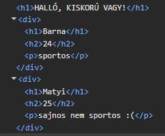
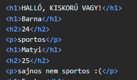

# React alapok

## Első React alkalmazás létrehozása

Korábban jó opció volt a `Create-React-App` használata, azonban ez már deprecatednek számít, úgyhogy célszerű a `Vite`-et használni, ami egy nagyon gyors build tool. Setítségével el tudunk készíteni egy sablon React projektet, feltelepíti a kezdeti szükséges dependency-ket, inicializál szükséges dolgokat, így nem kell manuálisan, kézzel összepakolni mindent:

```sh
npm create vite@latest
```

Itt majd a React-et kell választani, miután megadjuk a projektünk nevét. Célnak most megfelelel a sima `TypeScript` projekt is.

### A projekt felépítése

- public/ -> olyan statikus assetek találhatók itt, amiket nem dolgoz fel a `Vite`, ezek általában faviconok, ikonok, stb.

- srs/`main.tsx` -> a belépítési pontja az alkalmazásnak a React számára
- src/`App.tsx` -> ez a main React component
- src/`assets` -> képeket, hasonló dolgokat tárol
- src/`index.css` -> az alkalmazás globális stílusa

- `index.html` -> ez a main HTML file, itt a `root` div-en belülre jön majd az app, module-ként használja a `main.tsx`-et

```tsx
// ####################################
// main.tsx
// ####################################
createRoot(document.getElementById("root")).render(
  // A StrictMode egy "development mode tool", nincs hatással az appra productionben, segít fejlesztés során
  // mindenféle problémák beazonosítani az alkalmazásban
  <StrictMode>
    <App />
  </StrictMode>,
);
```

## Komponensek

Modern React keretein belül úgynevezett `függvénykomponenseket` fogunk létrehozni. Ezek lényegében egyszerű függvények lesznek, amik visszaadnak egy "csomópontot", ez igazából nem más, mint a `tsx`, ami egy markup. Ez teszi lehetővé, hogy HTML-szerű dolgokat tudjunk írni Reactben, úgy, hogy ötvözzük adott esetben a `TypeScript`-tel. Ebből kifolyólag minden ilyen létrehozott komponensnek a kiterjesztése `.tsx` lesz. A komponensen belül lehetnek változók, segédfüggvények és más JavaScript-kódrészletek is.

> ### 💡 MEGJEGYZÉS
>
> A konvenció azt mondja, hogy a komponensek nevei nagybetűvel kezdődnek, illetve majd a fájl neve megegyezik a benne létrehozott komponens nevével, így például a `CardItem` komponensen a `CardItem.tsx` fájlban helyezkedik el.

A fentieket figyelembe véve a legalapabb komponens valahogy így nézhez ki:

```jsx
const Item = () => {
  return <h1>Első komponens</h1>;
};

export default Item;
```

Megbeszéltük korábban, hogyan tudunk modulárisan programozni. Ezeket az ismereteket itt már **masszívan** használni fogjuk, ugyanis ahhoz, hogy egy komponenst meg tudjunk jeleníteni valamelyik másik komponensen belül, szükséges, hogy elérjük. Ehhez `exportáljuk`, majd pedig ahol használni szeretnénk, `importáljuk`. Így például ha az a célunk, hogy az `Item` komponens megjelenjen az `App` komponensen belül, akkor a következőképpen járunk el:

```jsx
import Item from "./components/Item";

function App() {
  return (
    <>
      <h1>Főoldal</h1>
      <Item />
    </>
  );
}

export default App;
```

> ### 💡 FONTOS
>
> Ahhoz, hogy a visszaadott JSX érvényes legyen, a komponensnek egy közös gyökérelemet kell visszaadnia. Ha több, egymás mellett álló elemet szeretnénk visszaadni, akkor ezeket valamilyen módon össze kell fognunk. Az egyik lehetőség, hogy körbevesszük őket például egy `<div>` elemmel. Ez akkor jó megoldás, ha valóban szeretnénk egy plusz szülőelemet a DOM-struktúrában. Sok esetben azonban erre nincs szükség, és felesleges lenne emiatt extra HTML-elemet létrehozni. Erre szolgál a `Fragment`, amelynek rövid szintaxisa a `<>...</>`. A Fragment lehetővé teszi, hogy több elemet egy csoportként adjunk vissza anélkül, hogy emiatt egy újabb HTML-tag jelenne meg a DOM-ban.

Strukturálisan `div`-vel:



Struktárálisan `Fragment`-tel:



Az egyik legalapabb dolog, amit szeretnénk, hogy tudjunk "behelyettesíteni" változókat a markupunkba. Erre szolgál a `{}` szintaxis, amivel JS(TS) kifejezéseket tudunk beilleszteni. Ez lehet akár egy változó, akár egy függvényhívás, vagy bármilyen érvényes JS(TS) kifejezés. Például:

```jsx
export default function App() {
  const name = "Ádám";

  return <h1>Hello, jó, hogy itt vagy, {name}!</h1>; // "behelyettesíti" a megadott nevet
}

// VAGY
export default function App() {
  const name = "Ádám";
  return name === "" ? <h1>Nincs kit üdvözölni</h1> : <h1>Hello, jó, hogy itt vagy, {name}</h1>; // "conditional rendering"
}

// VAGY
export default function App() {
  const applyStyle = true;
  return <h1 className={applyStyle ? "main-title" : ""}>Főcím</h1>
}
```

> ### 💡 MEGJEGYZÉS
>
> Reactban a stílusosztályokat a `className` attribútummal adjuk meg, nem a `class`-szal, mint a sima HTML-ben. Ennek az az oka, hogy a `class` egy kulcsszó a JavaScriptben, így Reactban elkerülik a használatát, és helyette a `className`-t használják. Minden más egyébként ugyanúgy működik. A fenti példában látjátok, hogy tudunk feltételesen is alkalmazni osztályokat.

### props

A `props` a komponensek közötti adatátadás egyik legfontosabb eszköze. A gyermek komponens a props nevű objektumban kapja meg azokat az adatokat, amelyeket a szülő komponens ad át neki. Ezek lehetnek például szövegek, számok, logikai értékek, objektumok, tömbök vagy akár függvények is. `TypeScript` használatakor érdemes a props típusát külön meghatározni, nyilván mi is ezt fogjuk tenni.

Néhány egyszerű példa:

1. Tegyük fel, hogy van egy komponensünk, ami egy termék leírását jeleníti meg: mi a neve, mennyibe kerül és elérhető-e. Ehhez elkészíthetjük az alábbi `ProductCard` komponenst. Nézzük meg, hogyan tudnánk definiálni a szükséges típusokat. Azt várjuk, hogy a `props object` tartalmazni fogja majd a fent említett értékeket, tehát kell egy `name` mező, ami egy string, egy `price` mező, ami egy szám, és egy `available` mező, ami egy logikai érték. Ezek alapján létrehozhatunk egy `ProductCardProps` típust:

```ts
interface ProductCardProps {
  name: string;
  price: number;
  available: boolean;
}
```

Ezután ezt a típust használhatjuk a komponensünkben, hogy meghatározzuk, milyen típusú adatokat várunk el a propsban:

```jsx
const ProductCard = ({ name, price, available }: ProductCardProps) => {
  return (
    <div>
      <h2>{name}</h2>
      <p>Ára: ${price.toFixed(2)}</p>
      <p>Elérhető: {available ? "Igen" : "Nem"}</p>
    </div>
  );
};

export default ProductCard;
```

> ### 💡 MEGJEGYZÉS
>
> A fent látható {} szintaxis a props objektum destrukturálását jelenti. Ez egy kényelmes módja annak, hogy közvetlenül a komponens paramétereiben hozzáférjünk a props mezőihez anélkül, hogy minden alkalommal a `props` objektumot kellene használni. Így például a `name`-et közvetlenül használhatjuk a JSX-ben, anélkül, hogy `props.name`-t írnánk.

Példa az objektumok destukturálására:

```js
const obj = {
  name: "Sanyi",
  age: 18,
};

const { name } = obj;
console.log(name); // Sanyi

// ugyanígy elkérhetném akár mindkettőt:
const { name, age } = obj;

// vagy csak az age-et:
const { age } = obj;
```

Tegyük fel, hogy szeretnénk kibővíteni a `ProductCard` komponenst egy új mezővel, ami a termék leírását tartalmazza, viszont azt szeretnénk, hogy a mező megadása ne legyen kötelező. Ehhez a `ProductCardProps` típusban a `description` mezőt opcionálissá kell tennünk, amit a `?` szintaxissal tehetünk meg:

```ts
interface ProductCardProps {
  name: string;
  price: number;
  available: boolean;
  description?: string; // ez opcionális mező
}
```

Sokszor szeretnénk azt, hogy tudjuk a saját komponensünket is úgy használni, mint egy "parent", a nyitó és záró tag közé helyezve tartalmat megjeleníteni benne. Példuál jó lenne, ha a `ProductCard`-ot úgy tudnánk használni, hogy a termékről extra információkat a nyitó és záró tag között tudnánk megadni:

```jsx
<ProductCard name="Laptop" price={999.99} available={true}>
  <p>Ez egy nagyszerű laptop, ami minden igényedet kielégíti!</p>
</ProductCard>
```

Ha minden módosítás nélkül megnéznénk, hogy működik-e, akkor **surprise** arra jutnánk, hogy NEM. Mi történik ilyenkor? A Reactnek van egy speciális mezője a propsban, amit `children`-nek hívnak, és ez tartalmazza azokat a dolgokat, amiket a nyitó és záró tag közé helyezünk. Tehát a `ProductCard` komponensben hozzá kell férnünk a `children`-hez, és meg kell jelenítenünk azt a megfelelő helyen. Ez magába foglalja a `children` típusának meghatározását is a `ProductCardProps`-ban, ami általában `React.ReactNode` szokott lenni:

```ts
interface ProductCardProps {
  name: string;
  price: number;
  available: boolean;
  description?: string;
  children?: React.ReactNode; // ez opcionális mező a children számára
}
```

Ezt követően nyilván el kell kérnünk a `children`-t a paraméterek között, illetve megjeleníteni azt. A megjelenítés gyakorlatilag egy egyszerű behelyettesítéssel történik, ahogy azt a példában is látjátok:

```jsx

const ProductCard = ({ name, price, available, children }: ProductCardProps) => {
  return (
    <div>
      <h2>{name}</h2>
      <p>Ára: ${price.toFixed(2)}</p>
      <p>Elérhető: {available ? "Igen" : "Nem"}</p>

      {children} {/* itt jelenítjük meg a children tartalmát */}
    </div>
  );
};

```

### Listák renderelése

Gyakori eset, hogy tömbben érkező adatokat szeretnénk megjeleníteni. Ha a fenti példával élünk, akkor ez lehet mondjuk egy terméklista. A cél az lenne, hogy minden egyes termékhez, amit a lista tartalmaz, jelenítsünk meg egy `ProductCard`-ot. Ekkor strukturálisan érdemes egy újabb komponent létrehozni. Ha a `ProductCard` komponenssel az volt a célunk, hogy egy termék kinézetét írjuk le, akkor most létrehozhatunk egy `ProductList` komponenst, ami a termékek listáját kezeli, és minden egyes termékhez megjeleníti a `ProductCard`-ot. Mielőtt ebbe belemegyünk, nézzük meg, hogyan működik a lista renderelés Reactban!

Reactban a lista rendereléshez általában a `map` függvényt használjuk, amivel végig tudunk menni egy tömb elemein, és minden elemhez hozzárendelhetünk egy JSX elemet. Tegyük fel először, hogy adott az alábbi terméklista:

```js
const products = [
  { id: 1, name: "Laptop", price: 999.99, available: true },
  { id: 2, name: "Telefon", price: 499.99, available: false },
  { id: 3, name: "Tablet", price: 299.99, available: true },
];
```

Az egyszerűség kedvéért most mondjuk azt, hogy ezt a `ProductList` komponensben definiáljuk. Szeretném, ha végigmennénk a `products` tömbön, és minden egyes termékhez kezdetben megjelenítenénk egy `<h1>`-et a termék nevével. Ez a következőképpen nézne ki:

```jsx
const ProductList = () => {
  const products = [
    { id: 1, name: "Laptop", price: 999.99, available: true },
    { id: 2, name: "Telefon", price: 499.99, available: false },
    { id: 3, name: "Tablet", price: 299.99, available: true },
  ];

  return (
    <div>
      {products.map((product) => (
        <h1 key={product.id}>{product.name}</h1>
      ))}
    </div>
  );
};

export default ProductList;
```

> ### 💡 FONTOS
>
> Megbeszéltük, itt is láthatjátok, hogy ilyenkor szükség van egy úgynevezett `key` attribútumra a parent elemnél. Erre szüksége van a Reactnek ahhoz, hogy tudja azonosítani, hogy melyik adathoz melyik element tartozik, így megfelelően tudja frissíteni a node-okat, ha változik, módosul az adat. Ez MINDENKÉPP `unique`. Mi van akkor, ha nincs id? Ilyenkor el tudom kérni a map-en belül az indexet is: `map(item, index)`. De ezzel óvóatosan, ha `read-only` dolgokat jelenítünk meg, akkor okés, viszont ha szúrhatunk be, törölhetünk dolgokat, akkor összeakadhat. Használhatunk valami külső package-et is, mint pl a `uuid`, ha nagyon szükséges az id, de nincs.

Most pedig hozzuk össze a kettőt:

1. A `ProductCard` komponensünket nem szükség módosítani (bár kétségtelen, lehetne refaktorálni egy közös típussal), de egyelőre maradjon így: megkapja a `name`, `price`, `available` és `children` mezőket a propsban, és megjeleníti ezeket.

2. A `ProductList` komponensben a `products` tömböt végigiterálva minden egyes termékhez megjelenítünk egy `ProductCard`-ot, és átadjuk neki a szükséges adatokat a propsban.

```jsx
const ProductList = () => {
  const products = [
    { id: 1, name: "Laptop", price: 999.99, available: true },
    { id: 2, name: "Telefon", price: 499.99, available: false },
    { id: 3, name: "Tablet", price: 299.99, available: true },
  ];

  return (
    <div>
      {products.map((product) => (
        <ProductCard
          key={product.id}
          name={product.name}
          price={product.price}
          available={product.available}
        >
          <p>Ez egy nagyszerű {product.name}!</p>
        </ProductCard>
      ))}
    </div>
  );
};

export default ProductList;
```

> ### 💡 MEGJEGYZÉS
>
> Bár gyakorlaton hozzáadtuk, valójában a `key`-t NEM KELL megadni a `props` között, ez egy speciális attribútum, amit a React használ a listaelemek azonosítására, de nem lesz elérhető a komponensünkben a `props`-ban. Így elég, ha a `map`-en belül megadjuk a `key`-t az elemnél!

## Eventek

Erről a következő gyakorlaton beszélünk majd részletesebben is, de érdemes pár dolgot megemlíteni már most. Az egyik legfontosabb dolog, hogy Reactban az eseménykezelés egy kicsit másképp működik, mint a sima HTML-ben, függvényt adunk át az eseménykezelőnek. Például, ha van egy gombunk, amire kattintva szeretnénk valamilyen műveletet végrehajtani, akkor a következőképpen nézne ki:

```jsx
// ...
<button onClick={() => console.log("Gombra kattintott!")}>
  Kattints ide!
</button>;

// vagy ha van egy külön függvényünk:
const handleClick = () => {
  console.log("Gombra kattintott!");
};
<button onClick={handleClick}>Kattints ide!</button>;

// ha esetleg szeretnénk egyéb paramétereket a handleClick-nek, akkor valahogy így nézne ki:
const handleClick = (message: string) => {
  console.log(message);
};
<button onClick={() => handleClick("Gombra kattintott!")}>
  Kattints ide!
</button>;
// ...
```

Természetesen függvényeket is át tudunk adni a komponenseknek a propsban, és fogunk is ilyet csinálni bőségesen. Ugyanaz a workflow, mint eddig, egyetlen dolog, ami érdesek lehet: hogyan bővítsük az `interface`-t. A szintaxis egyszerű:

```js
interface ComponentProps {
  // ...
  onClick: () => void; // ez egy olyan függvény, ami nem vár paramétert és nem ad vissza semmit
  onOtherClick: (message: string) => void; // ez egy olyan függvény, ami egy string paramétert vár és nem ad vissza semmit
  // ... és így tovább
}
```

Egyébként ugyanúgy adom át a függvényt, mint bármilyen más propot, tehát például:

```jsx
<Component onClick={handleClick} onOtherClick={handleOtherClick} />
```

> ### 💡 MEGJEGYZÉS
>
> Beszéltünk róla, hogyan kell az eseményobjektum típusát meghatározni. Erről itt találtok részletes információt: [React események típusai](https://nishanthan-k.medium.com/typescript-event-types-and-event-handling-in-react-a-complete-guide-for-beginners-22293ff4b8a0), ezt külön nem írnám át csak fordításként :D

## Mi a helyzet a stílusokkal?

Egyelőre csak annyit, hogy a `Vite`-tel létrehozott projektben van egy `index.css` fájl, amiben globális stílusokat tudunk megadni. Ez a fájl be van importálva a `main.tsx`-ben, így minden komponensünk hozzáfér ezekhez a stílusokhoz. Egyébként hogyan szoktunk stílusokat megadni Reactben? Általában két megközelítés van:

1. Természetesen működik az `inline` stílusok megadása, viszont van egy kis eltérés a korábban látott megközelítéstől: a `style` itt egy objektumot vár, amiben a kulcsok a CSS tulajdonságok nevei, de `camelCase` formában, és az értékek pedig a CSS értékek stringként. Például:

```jsx
<div style={{ backgroundColor: "red", fontSize: "20px" }}>
```

2. A `Vite` támogatja a CSS modulokat is, ami egy nagyon kényelmes megoldás arra, hogy a globális stílusok helyett komponensspecifikus stílusokat tudjunk használni. Általában az a konvenció, hogy a globálisnak szánt stílusokat `index.css`-ben helyezzük el, míg a komponensspecifikus stílusokat egy külön fájlban, például `ComponentName.module.css`-ben (nagyjából ez is a konvenció: komponens neve + `.module.css`). Ez a megközelítés lehetővé teszi, hogy a stílusok csak az adott komponensre legyenek érvényesek, és ne szennyezzék a globális stílusokat. Például, ha van egy `Button` komponensünk, akkor létrehozhatunk egy `Button.module.css` fájlt, amiben definiáljuk a gomb stílusait:

Ez nagyjából azt jelenteni a gyakorlatban, hogy ha van egy `components/Button.tsx` komponensünk, akkor a stílusait a `components/Button.module.css` fájlban helyezzük el. Ekkor a `Button.module.css` fájl például így nézhet ki:

```css
.mainButton {
  background-color: blue;
  color: white;
  padding: 10px 20px;
  border: none;
  border-radius: 5px;
  cursor: pointer;
}
```

Tehát a `CSS Modules` lényege, hogy a `.module.css` fájlban lévő osztályok alapértelmezett lokális hatókörűek, és a built folyamat során egyedi neveket kapnak, amiatt egy-egy osztálynevet több különböző komponensben is használhatunk anélkül, hogy ütköznének egymással. A generált egyedi osztályvan pl olyasmit jelent, hogy amikor mi azt írjuk:

```css
.button {
  background: royalblue;
}
```

Akkor a build után a böngészőben valami ilyesmi lesz:

```html
<button class="Button_button__a1b2c"></button>
```

A CSS Modules használatakor a stílusokat `.module.css` fájlban írjuk meg, majd ezeket importáljuk a komponensbe. Az import eredményeként egy `styles` objektumot kapunk vissza. Ebben az objektumban a saját osztályneveinkhez a rendszer egyedi, generált class neveket rendel. Ez azért hasznos, mert így ugyanazt az osztálynevet több helyen is használhatjuk anélkül, hogy a stílusok összeakadnának.

```jsx
import styles from "./Button.module.css";

const Button = () => {
  return <button className={styles.mainButton}>Mentés</button>;
};

export default Button;
```

## Képek kezelése

Amikor átbeszéltük a projekt felépítését, kitértünk arra, hogy az `assets` mappa tartalmazza a képeinket, egyéb statikus asseteket, arra viszont még nem néztünk példát, hogyan is tudjuk ezeket megjeleníteni. A helyzet egyszerű. Mivel a `Vite` feldolgozza ezeket az asseteket, ezért egyszerűen importálhatjuk a képeket a komponenseinkbe, és használhatjuk ők. Tegyük fel, hogy van egy `logo.png` képünk az `assets` mappában, és szeretnénk megjeleníteni azt a `Header` komponensünkben. Ehhez először importáljuk a képet:

```jsx
import logo from "../assets/logo.png"; // feltéve, hogy a Header komponens a src/components mappában van

const Header = () => {
  return (
    <header>
      
    </header>
  );
};

export default Header;
```
