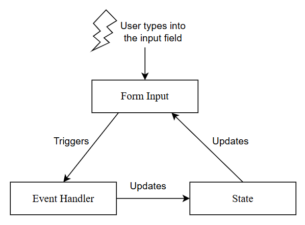

# Típusok

Alapvetően általában `interface`-eket hoztunk létre a félév során, és ezzel most is egészen jók lesztek.

```js
interface NoIdea {
    id: string;
    name: string;
    age: number | null;         // unio-típus, felveheti mindkét értéket
    something?: boolean;        // opcionális, nem kötelező megadni
}
```

Egyik leggyakoribb use-case, amikor a `props`-okat típusozzuk:

```js

interface HelloProps {
    name: string;
    age?: number;
    onClick: (text: string) => void; // egy olyan függvény, ami egy stringet kap paraméterül és void
    children?: React.ReactNode       // opcionális children paraméterem
}

// rögtön destrukturáljuk a props object. Lehetne úgy is, hogy
// const Hello = (props: HelloProps) => { ... }
const Hello = ({name, age, onClick, children}: HelloProps) => {
    return (
        <>
            <h1>Hello, {name}</h1>
            {children} {/* Rendereljük a childrent is, különben nem jelenne meg */}
        </>
    )
}
```

Tudunk type-okat is létrehozni, amikre gyakorlatilag úgy gondolhattok, mintha aliasok lennének:

```js
// ezzel tehát azt mondom, hogy State ezt a három értéket veheti fel, ha ezen felül bármilyen
// másik stringgel hozom létre az AppRequestet, nem lesz jó. Szóval lényegében egy "alias" jött létre,
// ami string, de uniója ennek a három specifikus stringnek, amit itt megadtunk
type State = "pending" | "fulfilled" | "rejected";

interface AppRequest {
  id: string;
  state: State;
}

const req: AppRequest = {
  id: "valami",
  state: "pending",
};
```

## Eseményobjektum

Handler-ök esetén szükséges, hogy az eseményobjektumot megfelelően type-oljuk. Néhány lehetséges eset, ami gyakran előjön/előjött/előjöhet. Fontos, hogy emlékezzetek, hogy az alap szintaxis ezeknél az, hogy:
`React.ValamilyenEvent<HTMLMegfelelőElement>`

```js
// onChange-hez kötöd, adott esetben most ez egy <input>-on hívódik meg, de lehetne pl:
// React.ChangeEvent<HTMLTextAreaElement>
// React.ChangeEvent<HTMLSelectElement>
const handleChange = (e: React.ChangeEvent<HTMLInputElement>) => {
    console.log(e.target.value);
};

// lehetne akár uniózni is ezeket a típusok, és például írni egy generikusabb handlert, ami
// képes egyben lekezelni egy <select>-et és egy <input>-ot
const handleChange2 = (e: React.ChangeEvent<HTMLInputElement | HTMLSelectElement>)

// kattintás
const handleClick = (e: React.MouseEvent<HTMLButtonElement>) => {
    console.log("clicked", e.target);
}

// form submit
const handleSubmit = (e: React.SubmitEvent) => {
    e.preventDefault();
}

// gombok lenyomása, nem igazán néztünk erre példát, de legyen itt azért egy-egy
const handleKeyDown = (e: React.KeyboardEvent<HTMLInputElement>) => {
    if (e.key === "Enter") {
      console.log("Enter pressed");
    }
};
```

# Form handling

A `controlled form` koncepcióval ismerkedtünk meg, célszerű ezt használni. Ilyenkor `event handler` és `state` irányítja a formnak a működését. A `state` értéke jelenik meg az input mezőben mint `value`. Ha pedig az input mező aktuális értéke változik, az meghívja a `handler`-t, ami frissíti a `state`-et. Tehát gyakorlatilag egy körkörös loopban mozog:


```js
// Célszerű egy state-et létrehozni, ami egy az egyben mapeli a form input mezőit, így például
// ha a következők mezői vannak a formnak:
// - text input
// - text input
// - number input
// akkor:

// fontos, hogy itt a key-ek nevei megfeleleljenek az input mezőkben a "name" property-nek,
// hiszen ezt akarjuk használni összekapcsolásként
export interface FormDataType {
  name: string;
  year: number;
  biography: string | null; // nem kötelező megadni
}

// akár kiemelhetünk egy initial state-et, ami legképezi az "üres" formot:
const INITIAL_STATE: FormDataType = {
  name: "",
  year: 2000,
  biography: "",
};

// így viszonylag egyszerűen létre tudjuk hozni a komponensen belül a state-et:
const MyForm = () => {
    const [formState, setFormState] = useState<FormDataType>(INITIAL_STATE);

    // Nem írunk ilyenkor egy külön handlert minden egyes input field lekezelésére,
    // tökéletesen elég egy, hiszen mindegyik egy HTMLInputElement. Egyszerűen csak azt kell
    // tudnunk, hogy melyik input field váltotta ki az eventet. Erre szolgál a "name" property, hiszen
    // megfeletethető a hozzá tartozó "key"-nek a FormDataType-ban. Tehát annyi a dolgunk, hogy az
    // aktuális target name-jét használjuk, és az annak megfelelő "key"-hez állítsuk be a target value-ját
    const handleInput = (e: React.ChangeEvent<HTMLInputElement>) => {
        const target = e.target;
        // ez a szintaxis az úgynevezett "computer property name", annyit mondunk, hogy használd a
        // target.name értékét mint property key
        setFormState({ ...formState, [target.name]: target.value });
    };

    // submit handler
    const handleSubmit = (e: React.SubmitEvent) => {
        e.preventDefault();

        // validáció, itt lehetne ellenőrizni pl, hogy a name hossza megfelelő-e,
        // tartani egy state-et, amiben az errorokat tárolod, ha nem megfelelő valami, akkor ennek
        // az értékét használod az error üzenet megjelenítésére. Ha minden okés, akkor pl. null
    }

    return (
        <form onSubmit={handleSubmit}>
            <h2>Details</h2>
            <div>
                <label htmlFor="name">Name:</label>
                <input
                type="text"
                id="name"
                name="name"
                value={formState.name}
                onChange={onChange}
                />
            </div>
            <div>
                <label htmlFor="name">Year:</label>
                <input
                type="number"
                id="year"
                name="year"
                value={formState.year}
                onChange={onChange}
                />
            </div>
            <div>
                <label htmlFor="name">Biography:</label>
                <input
                type="text"
                id="biography"
                name="biography"
                value={formState.biography ?? ""}
                onChange={onChange}
                />
            </div>
            <button className="waves-effect waves-light btn" type="submit">
                Add
            </button>
        </form>
    );
}
```

# Redux

Lépések:

1. Létrehozod a `store`-t mondjuk a `state/store.ts`-ben, egyelőre csak skeleton
2. Megírod a slice skeletonját mondjuk a `state/mySlice.ts`-ben
3. Bekötöd a `reducer`-t a `store`-ba
4. A `Provider` segítségével elérhető teszed a `store`-t

Nyilván ezek a lépések felcserélhetők, csak fontos, hogy a végén mindegyiket megcsináld.

## Store skeleton

```js
import { configureStore } from "@reduxjs/toolkit";

export const store = configureStore({
  reducer: {
    // ide jönnek majd a reducerek a következőképpen
    // name: reducer
    // Fontos, ha így használod, és a reducer egy object, akkor
    // ezzel altereket hozol létre (LÁSD [07] redux-rtk).
  },
});

// És az alterek miatt szükséges definiálni a RootState-et, ha
// precízen akarsz type-olni (szintén [07] redux-rtk)
export type RootState = ReturnType<typeof store.getState>;
```

## Slice skeleton

```js
import { createSlice } from "@reduxjs/toolkit";
import type { RootState } from "./store";


interface MySliceType {
    name: string;
    value: number[];
};

const initialState: MySliceType = {
    name: "Villám McQueen",
    value: [95]
};

const mySlice = createSlice({
    name: "mySlice",
    initialState,
    reducers: {
        // ide jönnek a reducerek, pl
        start: (state) => {
            state.name = "Matuka";
        },
    }
})

// action exportok, írd a további action-öket a { } közé
export const { start } = mySlice.actions;

// selectors
// ide írd majd a selectorokat, pl:
export const selectName = (state: RootState) => state.mySlice.name;

// Mivel ebben a selectorban származtatott értékekkel dolgozunk, ezért ez ebben a formában a console-on
// warningot fog okozni azzal, hogy "unnecessary rerender"-hez vezethet így. Ha ilyen van, célszerű a
// createSelector használata, lásd: [07] redux-rtk. De működni fog így is, el fogom fogadni!
export const selectValue = (state: RootState) => {
    const filteredValues = state.mySlice.value.filter(
        (value: number) => value > 0,
    );
    return {
        isFiltered: true,
        values: filteredValues,
    };
};

// reducer export
export default mySlice.reducer;
```

Így nézne ki a fenti `createSelector`-ral precízen megírva:

```js
const selectRawValues = (state: RootState) => state.mySlice.value;

export const selectValue = createSelector(
  [selectRawValues],
  (values) => {
    const filteredValues = values.filter(value => value > 0);

    return {
      isFiltered: true,
      values: filteredValues,
    };
  }
);
```

## Bekötés a store-ba:

Ekkor a `store.ts` így nézne ki az importtal:

```js

import { configureStore } from "@reduxjs/toolkit";
import mySliceReducer from "./mySlice"; // nyilván ahogy hívtad, ha nem mySlice.ts a neve, módosítsd!

export const store = configureStore({
  reducer: {
    mySlice: mySliceReducer,
  },
});

// És az alterek miatt szükséges definiálni a RootState-et, ha
// precízen akarsz type-olni (szintén [07] redux-rtk)
export type RootState = ReturnType<typeof store.getState>;
```

## Provider a main.tsx-ben

```js
import { store } from "./state/store.ts"; // ismét, ha nem itt van vagy nem store.ts, akkor módosítsd!

createRoot(document.getElementById("root")!).render(
  <StrictMode>
    <Provider store={store}>
      <App />
    </Provider>
  </StrictMode>,
);
```

# RTK Query

Hasonló lépéseket követsz, mint az előbb:

1. Létrehozod a `store`-t mondjuk a `state/store.ts`-ben, egyelőre csak skeleton
2. Megírod az API slice skeletonját mondjuk a `state/apiSlice.ts`-ben
3. Bekötöd a `reducer`-t a `store`-ba
4. A `Provider` segítségével elérhető teszed a `store`-t

## Store skeleton

_Ugyanaz, mint eggyel feljebb, a \_Redux_-nál

## API Slice skeleton

```js
import { createApi, fetchBaseQuery } from "@reduxjs/toolkit/query/react";

const BASE_URL = "http://localhost:4000/"; // állítsd megfelelően a portot

export const apiSlice = createApi({
  reducerPath: "apiSlice",
  baseQuery: fetchBaseQuery({ baseUrl: BASE_URL }),
  endpoints: (build) => ({
    // ide jönnek az endpointok
  }),
});

// kommenteld ki, mert a { } között exportáld a legenerált hookokat, pl:
// - ha van getStudents query-d         -> useGetStudentsQuery
// - ha van addStudent mutation-öd      -> useAddStudentMutation
// export const {} = apiSlice;
```

## Bekötés a store-ba

Ez a része ennyi, itt nem kell belenyúlnod, hacsak nem használsz más neveket, pl nem `apiSlice`, hanem bármi más. A `createApi` hívás eltérő a korábban használt `createSlice`-tól. Ennek a célja alapvetően az, hogy `data fetching`, `caching` logikát megoldja, ilyenkor lényegében egy `api slice` jön létre.

Pont emiatt, mivel nem csupán egy slice-okat hozunk létre, szükséges a `middleware`-ek módosítása is. Szeretném, ha megmaradna a korábban látott middleware, ami a `slice`-ok esetén funkcionál, de azt is szeretném, ha mindez kibővülni az RTK Query API middleare-ével. A `getDefaultMiddleware()` hívás visszaadja az RTK default middleware-ét, ami felelős a különböző biztonsági ellenőrzések elvégzéséért. Ezt egészítjük ki az RTK Query API middleware-ével, aminek a `caching`, `subscription`, `polling`, `refetching` a fő feladata.

```js
import { configureStore } from "@reduxjs/toolkit";
import { apiSlice } from "./apiSlice"; // ha más a neve vagy máshol van, módosítsd!

export const store = configureStore({
  reducer: {
    [apiSlice.reducerPath]: apiSlice.reducer,
  },
  middleware: (getDefaultMiddleware) =>
    getDefaultMiddleware().concat(apiSlice.middleware),
});
```

## Provider a main.tsx-ben

_Ugyanaz, mint eggyel feljebb, a \_Redux_-nál

## Néhány példa az RTK Query használatára

### GET Query-k

```js
// a DataType típust neked kell definiáld attól függően, hogy mit ad vissza a szerver, amikor
// kiküldesz egy GET kérést erre az endpointra. Ugye úgy működik a build.query és a build.mutation is,
// hogy két generikus paramétert vár, az első a visszaadott érték típusa, a második, amit paraméterként
// kap
import { createApi, fetchBaseQuery } from "@reduxjs/toolkit/query/react";

const BASE_URL = "http://localhost:4000/";

export const apiSlice = createApi({
  reducerPath: "apiSlice",
  baseQuery: fetchBaseQuery({ baseUrl: BASE_URL }),
  endpoints: (build) => ({
        getData: build.query<DataType[], void>({
            query: () => "data", // ekkor http://localhost:4000/data
            // ez egy shortcut itt, hiszen nem szükséges semmilyen összetett logikát építenem a query-ben,
            // csupán csak kimegy egy GET kérés a "data" endpointra. De pl írhatnám ezt úgy, hogy:
            //   query: () => ({
            //     method: "GET", // fölösleges itt egyébként megadni
            //     url: "data",
            //     // ha esetleg van authorization, akkor itt jönne a header:
            //     headers: {
            //         Authorization: "asdfasdf" // token
            //     }
            //   })
            //
        }),
        getDataById: build.query<DataType, string>({
            query: (id: string) => `data/${id}` // ekkor http://localhost:4000/data/:id
        })
  }),
});

export const { useGetDataQuery, useGetDataByIdQuery } = apiSlice;
```

Használata valamelyik komponensben:

```js
import { useGetDataQuery } from "./states/apiSlice";

const MyComponent = () => {
  // rögtön destrukturálom, feltéve, hogy ezekre van szükségem
  const { data, isLoading, isError } = useGetDataQuery();

  // ha úgy írtam volna meg, hogy egyébként ez a query kap valamilyen paramétert, például egy stringet,
  // akkor azt itt tudom neki átpasszolni:
  // const { data, isLoading } = useGetDataByIdQuery("myID");
};

export default MyComponent;
```

### Mutation-ök:

Hasonló a helyzet a `mutation`-ök építésekor is, ilyenkor a `build.mutation`-t használjuk, ugyanúgy két generikus paramétert fogunk megadni. Annyi változik csak, hogy itt már nem tudunk shortcutot használni, muszáj felépítenünk a kérés "testét". Mutationt használsz, ha:

- POST
- DELETE
- PATCH
- PUT

Lényegében a különbség ezek között csak annyi lesz, hogy a `method`-nak a megfelelőt adod meg, illetve úgy építed fel a `body`-t, amit az adott endpoint vár.

```js
import { createApi, fetchBaseQuery } from "@reduxjs/toolkit/query/react";

const BASE_URL = "http://localhost:4000/";

export const apiSlice = createApi({
  reducerPath: "apiSlice",
  baseQuery: fetchBaseQuery({ baseUrl: BASE_URL }),
  endpoints: (build) => ({
    // MyResponse, amit visszaad a szerver, NewData, amit be akarok küldeni
    addData: build.mutation<MyResponse, NewData>({
        query: (newData: NewData) => ({
            method: "POST",
            url: "data", // ekkor POST kérés ide: http://localhost:4000/data
            body: newData,
        }),
    }),

    // MyResponse, amit visszaad a szerver, utána most úgy építettem fel, hogy egy
    // objectet fogunk átadni, newData, amit be akarunk küldeni, id pedig az adat ID-ja,
    // amit módosítani fogunk, és ez lesz belefűzve a endpoint url-jébe is
    updateData: build.mutation<MyResponse, {newData: NewData, id: number}>({
        query: (data) => ({
            method: "PATCH",
            url: `data/${data.id}`, // ekkor PATCH kérés ide: http://localhost:4000/data/:id
            body: data.newData,
        }),
    }),

    // Minden ugyanaz mint fentebb leírva, kimegy egy DELETE, törli az adott ID-jú elemet
    deleteData: build.mutation<MyResponse, string>({
        query: (id: string) => ({
            method: "DELETE",
            url: `data/${id}`       // ekkor DELETE kérés ide: http://localhost:4000/data/:id
        })
    })
  }),
});

export const { useAddDataMutation, useUpdateDataMutation, useDeleteDataMutation } = apiSlice;

```

Használat valamelyik komponensen belül:

```js
import { useAddDataMutation } from "./states/apiSlice";

const MyComponent = () => {
  // Mutation-ök esetén egy tömböt kapunk vissza, első eleme egy függvény, második a response object.
  // Tetszőleges nével elkérhetem a függvényt, most "add"-ként tettem ezt. Itt majd a függvényt
  // fogjuk paraméterezni
  const [add, response] = useAddDataMutation();

  const handleSubmit = async (e: React.SubmitEvent) => {
    e.preventDefault();

    // validation
    // ...
    //

    // a newData itt nyilván NewData típusú, hiszen az add azt várja paraméterül
    const newData = {
        name: "Luigi",
        type: "car"
    }

    // aszinkron történik, bevárjuk, ezért kell az await, illetve emiatt async a handler is.
    // unwrap() a végén, hogy kicsomagoljuk a visszakapott objectből a tényleges választ
    const newArtist = await add(newData).unwrap();
    console.log(newArtist);
  };
};

export default MyComponent;
```

### Tags

A caching miatt, ha valahol megjelenítünk adatokat, amiket lekérünk a szerverről, illetve ugyanezeket az adatokat módosítjuk is, például tudjuk őket törölni, hozzáadni, stb, akkor nem mindig a legfrissebb állapotott fogjuk látni renderelve, ugyanis bár kimegy a `POST` vagy a `DELETE` kérés megfelelően, és az adatbázisban változnak is a rekordok, a RTK nem fogja automatikusan újrakérni ilyenkor hatékonysági okok miatt az adatokat, hanem a cache-hez nyúl. Nekünk kell az RTK tudtára adni, ha bizonyos mutation-ök végrehajtódtak, akkor szükséges az adatok újrakérése, és a cache frissítése. Erre vannak a `Tag`-ek, itt három fontos kulcsszavunk lesz:

- `tagTypes` -> ezzel soroljuk fel, hogy az apiSlice-unk milyen tag-ekkel rendelkezik
- `provideTags` -> a visszaadott adatot megjelöli ezzel a taggel, a cachelt adat "provide"-olja ezt
- `invalidateTags` -> lényegében azt mondja, hogy "ha ez a mutation lefutott, minden cache-elt query, ami "provid"-olja az adott tag-et, most már nem aktuális

Gyakorlati példa:

```js
import { createApi, fetchBaseQuery } from "@reduxjs/toolkit/query/react";
import type { Artist, NewArtist } from "../types";

const BASE_URL = "http://localhost:4000/";

export const artistApi = createApi({
  reducerPath: "artistApi",
  baseQuery: fetchBaseQuery({ baseUrl: BASE_URL }),
  tagTypes: ["Artist"],
  // tehát ezek a tag-ek léteznek, adott esetben 1, de lehetne több is, pl: ["Artist", "Student"]
  endpoints: (build) => ({
    getArtists: build.query<Artist[], void>({
      query: () => "artists",
      providesTags: ["Artist"],
      // ehhez a query-hez ez a tag tartozik, ha ez invalidálódik, újrakéri
    }),
    addArist: build.mutation<Artist, NewArtist>({
      query: (artist: NewArtist) => ({
        method: "POST",
        url: "artists",
        body: artist,
      }),
      invalidatesTags: ["Artist"],
      // amikor lefut a mutation, invalidálja ezt a taget, újrakér ilyenkor minden query-t,
      // ami "provide"-olja ezt (vagy ezeket) a tag-eket
    }),
  }),
});

export const {
  useGetArtistsQuery,
  useAddAristMutation,
} = artistApi;
```
